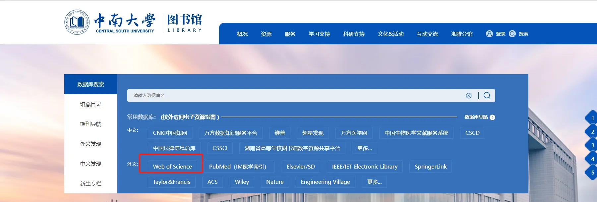

# [Getting Started with AI: Resources and Guides](#-getting-started-with-ai-resources-and-guides)
- [Getting Started with AI: Resources and Guides](#getting-started-with-ai-resources-and-guides)
  - [前言](#前言)
  - [编程语言](#编程语言)
    - [Python-菜鸟教程](#python-菜鸟教程)
      - [教程特点](#教程特点)
      - [学习建议](#学习建议)
    - [聪明办法学 Python 第二版](#聪明办法学-python-第二版)
      - [学习资源](#学习资源)
      - [教程特色](#教程特色)
      - [课程目录](#课程目录)
      - [创建和管理 Python 虚拟环境](#创建和管理-python-虚拟环境)
    - [PyTorch 官方教程](#pytorch-官方教程)
      - [教程结构简介](#教程结构简介)
      - [学习建议](#学习建议-1)
    - [R (todo)](#r-todo)
  - [动手学深度学习 PyTorch版](#动手学深度学习-pytorch版)
    - [主要讲授内容](#主要讲授内容)
    - [章节安排](#章节安排)
    - [学习建议](#学习建议-2)
  - [实用机器学习（Practical Machine Learning）](#实用机器学习practical-machine-learning)
    - [课程结构与主要内容](#课程结构与主要内容)
    - [学习建议](#学习建议-3)
  - [徐亦达周末机器学习讨论](#徐亦达周末机器学习讨论)
      - [课程概述](#课程概述)
      - [课程结构](#课程结构)
      - [学习资源](#学习资源-1)
      - [适用人群](#适用人群)
  - [南瓜书 PumpkinBook](#南瓜书-pumpkinbook)
    - [项目背景](#项目背景)
  - [Machine Learning From Scratch](#machine-learning-from-scratch)
    - [教程模块与主要内容](#教程模块与主要内容)
      - [数据处理模块（Data Processing）](#数据处理模块data-processing)
      - [数学基础模块（Math）](#数学基础模块math)
      - [机器学习算法模块（Algorithm）](#机器学习算法模块algorithm)
    - [学习建议](#学习建议-4)
  - [强化学习](#强化学习)
    - [Datawhale, 强化学习，EasyRL, 约需3小时](#datawhale-强化学习easyrl-约需3小时)
      - [教程特色](#教程特色-1)
      - [使用说明](#使用说明)
      - [学习推荐](#学习推荐)
  - [大语言模型](#大语言模型)
    - [Datawhale, 大语言模型（LLM）原理与实践](#datawhale-大语言模型llm原理与实践)
      - [项目简介](#项目简介)
      - [项目受众](#项目受众)
    - [大语言模型LLMBook, 建议学习](#大语言模型llmbook-建议学习)
      - [项目背景](#项目背景-1)
  - [AI智能体](#ai智能体)
    - [DataWhale- handy-multi-agent](#datawhale--handy-multi-agent)
  - [模型压缩](#模型压缩)
    - [Datawhale, 模型减肥秘籍：模型压缩技术](#datawhale-模型减肥秘籍模型压缩技术)
      - [项目简介](#项目简介-1)
      - [项目意义](#项目意义)
      - [项目受众](#项目受众-1)
      - [项目亮点](#项目亮点)
  - [因果发现 (causal discovery)](#因果发现-causal-discovery)
    - [pywhy](#pywhy)
    - [causal discovery](#causal-discovery)
    - [Causal Discovery Toolbox: Uncover causal relationships in Python](#causal-discovery-toolbox-uncover-causal-relationships-in-python)
    - [gCastle](#gcastle)
    - [CausalNex’s API docs and tutorials!](#causalnexs-api-docs-and-tutorials)
  - [Diffusion](#diffusion)
    - [Awesome Diffusion Models in Medical Imaging](#awesome-diffusion-models-in-medical-imaging)
  - [如何读论文](#如何读论文)
  - [计算机视觉方法必读经典论文](#计算机视觉方法必读经典论文)
    - [AlexNet](#alexnet)
    - [ResNet](#resnet)
  - [医疗AI方向必读经典论文](#医疗ai方向必读经典论文)
  - [大语言模型/多模态大模型方向必读经典论文/博客](#大语言模型多模态大模型方向必读经典论文博客)
    - [基于transformers的自然语言处理(NLP)入门，约需3小时](#基于transformers的自然语言处理nlp入门约需3小时)
    - [fun-transformer](#fun-transformer)
    - [A Survey of Large Language Models](#a-survey-of-large-language-models)
    - [Multimodal large model pretraining, adaptation and efficiency optimization](#multimodal-large-model-pretraining-adaptation-and-efficiency-optimization)
  - [数据挖掘/分析经典论文/博客](#数据挖掘分析经典论文博客)
    - [Joyful-Pandas](#joyful-pandas)
      - [项目背景](#项目背景-2)
  - [常用库和工具](#常用库和工具)
    - [Hugging Face](#hugging-face)
      - [Hugging Face Transformers 萌新完全指南](#hugging-face-transformers-萌新完全指南)
    - [非规则时间序列](#非规则时间序列)
      - [PyPOTS-github](#pypots-github)
      - [PyPOTS-pypi](#pypots-pypi)
      - [PyPOTS-Homenpage](#pypots-homenpage)
    - [数据库](#数据库)
      - [PostgreSQL 教程](#postgresql-教程)
    - [使用 rsync 进行大文件复制](#使用-rsync-进行大文件复制)
      - [1. 什么是 rsync](#1-什么是-rsync)
      - [2. 为什么使用 rsync](#2-为什么使用-rsync)
      - [3. 如何安装 rsync](#3-如何安装-rsync)
        - [Debian/Ubuntu 系列](#debianubuntu-系列)
        - [CentOS/RHEL 系列](#centosrhel-系列)
        - [Arch Linux](#arch-linux)
      - [4. 基本命令格式](#4-基本命令格式)
        - [参数说明](#参数说明)
      - [5. 如何保证传输可靠性（断点续传）](#5-如何保证传输可靠性断点续传)
      - [6. 路径末尾 `/` 的区别](#6-路径末尾--的区别)
        - [示例目录结构](#示例目录结构)
        - [情况一：源路径 **带 `/`**](#情况一源路径-带-)
        - [情况二：源路径 **不带 `/`**](#情况二源路径-不带-)
        - [总结对比](#总结对比)
      - [7. 推荐命令实例](#7-推荐命令实例)
      - [8. 文件总数校验方法](#8-文件总数校验方法)
      - [9. 常见问题及注意事项](#9-常见问题及注意事项)
        - [是否要使用 `--inplace`？](#是否要使用---inplace)
        - [是否可以将多条命令一起粘贴到 Shell 中执行？](#是否可以将多条命令一起粘贴到-shell-中执行)
      - [10. 总结：建议命令模板](#10-总结建议命令模板)
    - [BorgBackup 新手指南：从零开始进行安全高效的数据备份](#borgbackup-新手指南从零开始进行安全高效的数据备份)
      - [前言](#前言-1)
      - [1. 安装 BorgBackup](#1-安装-borgbackup)
      - [2. 初始化备份仓库](#2-初始化备份仓库)
      - [3. 使用相对路径执行第一次完整备份](#3-使用相对路径执行第一次完整备份)
      - [4. 查看已有备份快照](#4-查看已有备份快照)
      - [5. 检查快照中的文件结构](#5-检查快照中的文件结构)
      - [6. 恢复指定版本的快照](#6-恢复指定版本的快照)
      - [7. 备份多个快照（按天执行）](#7-备份多个快照按天执行)
      - [8. 常见命令速查表](#8-常见命令速查表)
      - [9. 注意事项](#9-注意事项)
      - [结束语](#结束语)
  - [文献查阅](#文献查阅)
    - [谷歌学术](#谷歌学术)
      - [基础使用](#基础使用)
      - [进阶使用-常用搜索规则（操作符）](#进阶使用-常用搜索规则操作符)
        - [组合使用操作符的示例](#组合使用操作符的示例)
        - [注意事项](#注意事项)
    - [web of science](#web-of-science)
    - [tips](#tips)
  - [学术论文写作](#学术论文写作)
  - [说明](#说明)


欢迎来到本仓库，这里收集整理了适合人工智能初学者的学习资源与教程！

## 前言

欢迎访问本仓库，本教程旨在为人工智能初学者提供系统、实用的入门资源。
- 人工智能基础概念  
- 实战操作教程  
- 推荐课程与阅读资料
- 蓝色字体均为可跳转链接，点击后可跳转

⚠️
本教程中所涉及的命令与代码均经过认真编写与多轮校对，并在常见环境中进行了测试和验证，力求准确无误。然而，由于篇幅较长、路径复杂，仍可能存在未能察觉的笔误、格式问题或在特定系统环境下未曾预料的行为。尽管已尽力检查且未发现明显错误，仍建议在执行前仔细核对命令内容，特别是涉及数据路径、删除操作等敏感步骤。如条件允许，可先在测试目录中进行验证，以确保数据安全与操作的正确性。

🗓️ 更新日期：2025 年 7 月 29 日（北京时间）


## 编程语言
### Python-菜鸟教程

对于初学者而言，掌握 Python 的基础知识和环境配置至关重要。菜鸟教程提供了详尽的 [Python3](https://www.runoob.com/python3/python3-tutorial.html)教程，采用案例驱动的教学方式，帮助学习者快速上手。
#### 教程特点
结构清晰，内容全面：涵盖从基础语法、数据类型、控制结构到函数、模块、面向对象编程等核心概念。

案例丰富，实践导向：每个知识点配有示例代码，便于理解和实践。

进阶内容：包括正则表达式、网络编程、多线程、数据库操作等，满足不同层次学习者的需求。


#### 学习建议
系统学习：建议按照教程顺序逐章学习，打好基础。

动手实践：结合示例代码，亲自编写和调试，提升编程能力。

查阅文档：遇到不理解的概念，可参考官方文档或其他权威资料加深理解。

通过系统学习菜鸟教程的内容，学习者将能够全面掌握 Python 的基础知识和编程技能，为进一步深入学习或实际应用打下坚实基础。

### 聪明办法学 Python 第二版
[](https://github.com/MYD753Q/learn-python-the-smart-way-v2-MYD753Q)

《聪明办法学 Python 第二版》是由 Datawhale 组织开发的开源 Python 教程，旨在为零基础、非科班背景的学习者提供一套简明系统的 Python 入门路径。该教程在第一版的基础上进行了大幅更新，融入了更多计算机科学与人工智能相关的内容，致力于打造“面向人工智能的 Python 专项教程”。

#### 学习资源

* **课程主页**：[https://datawhalechina.github.io/learn-python-the-smart-way-v2/](https://datawhalechina.github.io/learn-python-the-smart-way-v2/)
* **GitHub 仓库**：[https://github.com/datawhalechina/learn-python-the-smart-way-v2](https://github.com/datawhalechina/learn-python-the-smart-way-v2)
* **Bilibili 视频课程**：[https://www.bilibili.com/video/BV1x44y1w76d/](https://www.bilibili.com/video/BV1x44y1w76d/)

#### 教程特色

* **面向 AI 的 Python 学习路径**：课程内容不仅涵盖 Python 基础知识，还引导学习者逐步迈入人工智能领域，为后续学习打下坚实基础。

* **结构清晰，内容丰富**：教程分为基础篇和进阶篇，基础篇包括安装、数据类型、函数、控制流等内容，进阶篇将涵盖面向对象编程、数据结构等高级主题。

* **多样化的学习资源**：提供文字教程、视频讲解、课件、作业系统等多种学习资源，满足不同学习者的需求。

* **社区支持与互动**：学习者可以通过组队学习、答疑交流等方式，与其他学习者和教学团队互动，共同进步。

#### 课程目录

基础篇（已完成）：

* Chapter 0：安装（Installation）
* Chapter 1：启航（Getting Started）
* Chapter 2：数据类型和操作（Data Types and Operators）
* Chapter 3：变量与函数（Variables and Functions）
* Chapter 4：条件语句（Conditionals）
* Chapter 5：循环（Loop）
* Chapter 6：字符串（Strings）

进阶篇（制作中）：

* Chapter 7：列表与元组（Lists and Tuples）
* Chapter 8：集合（Sets）
* Chapter 9：字典（Dictionaries）
* Chapter 10：面向对象编程（一）（Object Oriented Programming Part 1）
* Chapter 11：面向对象编程（二）（Object Oriented Programming Part 2）


---

#### 创建和管理 Python 虚拟环境

创建虚拟环境是处理多个项目或解决环境依赖冲突的重要方法。主要原因包括：

- 便于版本管理和项目隔离：不同项目可能需要不同的 Python 版本和依赖库，使用虚拟环境可以轻松解决兼容性问题。
- 避免权限问题：在虚拟环境中安装库不需要管理员权限，更加灵活安全。

使用 Anaconda 管理虚拟环境，建议掌握以下基本操作。以下示例中演示了如何创建环境名为myenv,python版本为3.8的虚拟环境，并安装numpy包：

1. 安装 Anaconda（参考：[Anaconda官方下载页面](https://www.anaconda.com/download)）
2. 创建虚拟环境：`conda create --name myenv python=3.8`
3. 激活虚拟环境：`conda activate myenv`
4. 安装库（如 numpy）：`conda install numpy` 或 `pip install numpy`
5. 删除虚拟环境：`conda remove --name myenv --all`
6. 查看所有虚拟环境：`conda info --envs`
7. 查看当前环境的所有依赖包：`conda list` 或 `pip list`
### PyTorch 官方教程

[PyTorch Tutorials 官方文档](https://docs.pytorch.org/tutorials/) 提供了丰富的示例和模块化教程，覆盖从初学者入门到工程部署的完整学习路径。该文档不仅帮助用户掌握基础语法和操作，还深入涵盖模型优化、多模态建模、强化学习等高级主题，是系统学习 PyTorch 的权威资源。

#### 教程结构简介

教程按功能模块划分，主要包括以下部分：

1. **PyTorch Recipes**
   简洁实用的功能片段和代码示例，适合查阅具体技巧或功能实现方法。

2. **Introduction to PyTorch**
   PyTorch 入门必读，涵盖张量操作、自动求导、模块定义等基础知识。

3. **Learning PyTorch**
   进阶学习路径，围绕训练流程、模型结构与损失函数等核心组件进行讲解。

4. **Image and Video / Audio**
   图像与音频处理相关的教程，包括数据加载、增强和模型训练。

5. **Backends / Frontend APIs / Extending PyTorch**
   面向高级用户的底层机制与框架扩展方法，帮助理解 PyTorch 的内部工作原理。

6. **Reinforcement Learning**
   使用 PyTorch 实现强化学习算法，包括 Q-learning、策略梯度等方法。

7. **Deploying PyTorch Models in Production**
   教授如何将训练好的模型部署到生产环境，包括 TorchScript 和移动端部署。

8. **Profiling PyTorch / Model Optimization**
   包括性能分析与模型加速方法，如量化、剪枝、图优化等。

9. **Parallel and Distributed Training**
   多卡训练和分布式计算的教程，适用于大规模模型或多节点部署。

10. **Edge with ExecuTorch / Multimodality**
    新增内容，涉及边缘部署与多模态学习，前沿技术探索的重要模块。

11. **Recommendation Systems**
    教授如何用 PyTorch 构建和训练推荐系统。

12. **Code Transforms with FX**
    使用 FX 框架对模型图进行变换，适合模型结构可视化与优化实验。
#### 学习建议

* **由浅入深，按需选择**：初学者建议从 *Introduction to PyTorch* 和 *Learning PyTorch* 开始，掌握基本流程后再扩展至优化、部署等模块。
* **结合官方代码仓库实践**：Tutorials 页面通常配有配套的 GitHub 示例代码，建议边学边练。
* **主题式深入研究**：针对具体研究方向（如 CV、RL、推荐系统），可聚焦对应模块，进行系统性学习。
* **阅读源码与文档结合**：高级模块如 *Extending PyTorch* 与 *FX* 更侧重内部机制，推荐与源码阅读结合理解。
* **关注更新版本**：随着 PyTorch 版本更新，官方教程内容也在不断演进，建议使用与本地环境一致的教程版本。
### R (todo)  

---
## 动手学深度学习 PyTorch版
李沐老师在哔哩哔哩（Bilibili）平台上主讲的《动手学深度学习 PyTorch版》课程，旨在通过实践引导学习者掌握深度学习的核心概念和技术，特别是使用PyTorch框架进行实现。

### 主要讲授内容

课程涵盖深度学习的基础知识、模型构建、优化算法以及在计算机视觉和自然语言处理等领域的应用。通过结合理论讲解和代码实现，帮助学习者理解并应用深度学习技术。


[动手学深度学习-电子书](https://zh.d2l.ai/)  

[bilibili视频授课](https://space.bilibili.com/1567748478/lists/358497?type=series)  

[Datawhale组队学习资料](https://www.datawhale.cn/learn/summary/17)

### 章节安排

1. **深度学习基础**：介绍深度学习概念、数据操作、线性代数、自动求导等预备知识。
2. **线性神经网络**：讲解线性回归、Softmax回归等基础模型及其实现。
3. **多层感知机**：深入探讨多层感知机的结构、模型选择、正则化方法等。
4. **卷积神经网络**：介绍卷积层、池化层等CNN基础组件及经典网络结构，如LeNet、AlexNet等。
5. **循环神经网络**：讲解RNN、LSTM、GRU等序列模型及其应用。
6. **注意力机制**：介绍注意力机制的概念及Transformer模型。
7. **优化算法与计算性能**：讨论深度学习中的优化方法和提升计算性能的技巧。
8. **应用实践**：展示深度学习在计算机视觉和自然语言处理中的实际应用案例。

### 学习建议

* **实践为主**：结合课程中的代码示例，动手实现各类模型，加深理解。
* **系统学习**：按照课程章节顺序学习，逐步构建对深度学习的全面认识。
* **参与讨论**：利用课程提供的论坛或社区，与其他学习者交流问题和经验。
* **参考教材**：配合《动手学深度学习》第二版教材，获取更详细的理论和实践指导。
* **需求导向**：结合自身的应用场景和研究需求，有针对性地选择重点章节进行学习，避免盲目从头到尾照搬式学习。
通过以上学习路径，可以扎实掌握深度学习的理论基础和实践技能，为进一步研究或应用奠定坚实基础。

---

## 实用机器学习（Practical Machine Learning）
[](https://zhuanlan.zhihu.com/p/411337554)

李沐老师在 Bilibili 上的《斯坦福 2021 秋季·实用机器学习（CS329P）》课程，聚焦于机器学习在工业界的实际应用，强调从数据获取到模型部署的完整流程。课程内容丰富，涵盖数据处理、模型训练、评估与部署等关键环节，适合希望将机器学习技术应用于实际项目的学习者。

* **主讲教师**：李沐（Mu Li）、黄清清（Qingqing Huang）、Alex Smola
* **课程平台**：Bilibili（[课程链接](https://www.bilibili.com/video/BV13U4y1N7Uo/)）
* **课程主页**：[https://c.d2l.ai/stanford-cs329p/](https://c.d2l.ai/stanford-cs329p/)
* **课程语言**：中文讲解，配有英文资料
* **适合人群**：具备基础编程和机器学习知识，期望深入了解机器学习在实际应用中的完整流程的学习者

### 课程结构与主要内容

课程共分为四大模块，涵盖以下内容：

1. **数据收集与处理**

   * 数据获取与爬取
   * 数据清洗与预处理
   * 特征工程与数据变换
   * 数据标注与半监督学习

2. **模型训练与评估**

   * 常用模型介绍（线性模型、决策树、神经网络等）
   * 模型评估指标与验证方法
   * 过拟合与欠拟合的识别与处理
   * 模型融合技术（Bagging、Boosting、Stacking）

3. **高级主题与优化**

   * 超参数调优与自动化搜索（AutoML）
   * 迁移学习与微调策略
   * 模型压缩与蒸馏
   * 多任务学习与多模态融合

4. **模型部署与维护**

   * 模型上线与服务部署
   * 性能监控与反馈机制
   * 公平性与可解释性
   * 因果推理与决策支持

课程还特别强调了数据偏移（如协变量偏移、概念漂移）对模型性能的影响，并介绍了应对策略。  


### 学习建议


* **结合实践**：在学习过程中，结合实际项目或案例进行练习，加深理解。
* **关注数据质量**：重视数据的获取与处理，确保模型训练的基础可靠。
* **持续迭代**：模型部署后，持续监控其性能，并根据反馈进行优化。
* **拓展知识面**：深入学习课程中提到的高级主题，如迁移学习、模型压缩等，提升模型的实用性和效率。
通过系统学习本课程，学习者将能够全面掌握机器学习在实际应用中的各个环节，从而更有效地将理论知识应用于实际项目中。

---
## [徐亦达周末机器学习讨论](https://github.com/roboticcam/machine-learning-notes)

#### 课程概述
欢迎来到由 roboticcam 提供的机器学习、概率模型与深度学习课程！这是一套全面且不断更新的学习资源，包含超过 2000 页的讲义和丰富的视频链接。课程内容涵盖了从基础到高级的机器学习理论，适合不同层次的学习者。无论你是初学者还是希望深入研究的学者，都能在这里找到有价值的学习材料。

#### 课程结构
课程分为多个部分，每个部分都包含了详细的讲义和相关的视频教程。以下是课程的主要模块：

1. **机器学习基础**
   - **模型评估**：介绍分类模型评估的常见概念和技术，包括自举抽样、混淆矩阵、接收器操作特征 (ROC) 曲线等。
   - **决策树**：除了决策树的基础知识外，还增加了卡方检验部分。
   - **简单贝叶斯**：对概率的基本概念、贝叶斯定理、概率的图形模型进行直观解释。
   - **回归分析**：解释线性回归和多项式回归，以及评估回归性能的技术，特别是确定系数 (CoD) 方法。
   - **神经网络**：展示三个不同的最后输出层模型（逻辑回归、多项式回归和线性回归），介绍梯度下降的概念，以及全连接神经网络和卷积神经网络。
   - **无监督学习**：描述无监督学习中的常见主题，包括聚类、主题建模（如 LDA）和传统的词嵌入（如 word2vec）。

2. **中级数学与机器学习**
   - **期望最大化（EM）算法**：包括高斯混合模型的 EM 示例，以及相关的 Matlab 演示代码和视频。
   - **马尔可夫链蒙特卡洛（MCMC）**：介绍随机矩阵、幂法收敛、详细平衡和 PageRank 算法，以及基本的 MCMC 方法，如 Metropolis-Hasting 和 Gibbs。
   - **变分推断**：解释变分贝叶斯非指数和指数族分布，提供相关的 Matlab 演示代码和视频。
   - **状态空间模型（动态模型）**：详细解释卡尔曼滤波器和隐马尔可夫模型，提供相关的 Matlab 演示代码和视频。

3. **深度学习研究主题**
   - **方差减少**：介绍 REBAR、RELAX 算法以及 Gumbel 条件概率的重新参数化。
   - **Softmax 函数的新研究**：探讨分布外、神经网络校准、Gumbel-Max 技巧和随机光束搜索。
   - **生成对抗网络（GAN）的数学**：解释 GAN 的工作原理，包括传统 GAN、W-GAN、Info-GAN 和贝叶斯 GAN。
   - **高级变分自编码器**：介绍变分自编码器的工作原理，包括重要性加权自编码器、通过 ELBO 的标准化流、对抗变分贝叶斯、混合密度自编码器和 stick-breaking 自编码器。
   - **无限深度：NeuralODE 和伴随方程**：讨论神经 ODE，特别是在参数训练中使用伴随方程。

4. **优化方法**
   - **梯度下降研究**：提供关于梯度下降算法的隐式偏差和隐式正则化的渐进式研究笔记，以及随机梯度下降的收敛研究。
   - **对偶性教程**：介绍拉格朗日对偶、对偶函数、KKT 条件、支持向量机示例和 Farkas 引理。
   - **共轭梯度下降**：对共轭梯度下降进行快速解释。

5. **深度学习基础**
   - **卷积神经网络**：从基础到最近的研究，包括各种损失函数、中心损失、对比损失、残差网络、胶囊网络、YOLO 和 SSD。
   - **受限玻尔兹曼机（RBM）**：介绍 RBM 和对比发散（CD）的基础知识。

6. **3D 几何计算机视觉**
   - **3D 几何基础**：包括相机模型、内部和外部参数估计、对极几何、三维重建和图像深度估计。
   - **基于深度 3D 几何的最新研究**：探讨单图像到相机模型估计、基于多视图的多人 3D 姿势估计、基于 GAN 的 3D 姿势估计、基于运动的深度结构和基于深度学习的深度估计。

7. **强化学习**
   - **强化学习基础**：介绍马尔可夫决策过程、贝尔曼方程和深度 Q 学习。
   - **蒙托卡罗树搜索**：介绍蒙托卡罗树搜索和 AlphaGo 学习算法。
   - **策略梯度**：介绍策略梯度定理、可信区域优化的数学、TRPO 自然梯度、近似策略优化（PPO）和共轭梯度算法。

8. **自然语言处理**
   - **词嵌入**：介绍 GloVe、Fasttext 和负采样。
   - **深度自然语言处理**：包括递归神经网络、LSTM、具有注意力机制的 Seq2Seq、集束搜索、指针网络和 "Attention is all you need"。

9. **概率模型**
   - **概率估计**：介绍一些常用的分布、共轭特性、最大似然估计、最大后验估计、指数族和自然参数。
   - **蒙特卡洛推理**：包括逆 CDF 采样、拒绝式采样、自适应拒绝式采样和重要性采样。
   - **马尔可夫链蒙特卡洛**：介绍 M-H、Gibbs、Slice Sampling、椭圆 Slice 采样、Swendesen-Wang 和使用 LDA 的折叠 Gibbs。
   - **粒子滤波器（序列蒙特卡洛）**：介绍序列蒙特卡洛、凝聚滤波器算法和辅助粒子滤波器。

10. **高级概率模型**
    - **非参贝叶斯及其推导基础**：介绍狄利克雷过程、中国餐馆过程、狄利克雷过程 Slice 采样。
    - **非参贝叶斯扩展**：包括层次狄利克雷过程、分层狄利克雷过程-隐马尔可夫模型和印度自助餐过程（IBP）。
    - **完全随机测度**：介绍 Levy-Khintchine 表示、复合 Poisson 过程、Gamma 过程和负二项过程。
    - **从 HDP 和 Copula 采样相关整数**：提供对 IJCAI 2016 论文的不同解释。
    - **行列式点过程**：解释 DPP 的边缘分布、L-ensemble、其抽样策略以及在时变 DPP 中的工作。

#### 学习资源
- **视频教程**：部分讲义内容已录制为视频，可在 YouTube、哔哩哔哩和优酷上找到。
- **代码示例**：提供 Matlab 和 Python 的代码示例，帮助学习者更好地理解和实践。
- **讲义下载**：所有讲义均可在 GitHub 仓库中找到，方便学习者随时下载和查阅。

#### 适用人群
- **初学者**：希望通过系统学习掌握机器学习基础的学员。
- **中级学者**：希望深入了解机器学习中级数学和深度学习理论的学习者。
- **高级研究者**：对机器学习前沿研究主题感兴趣的学者和研究人员。


---
## [南瓜书 PumpkinBook](https://www.datawhale.cn/learn/summary/2)

### 项目背景  


周志华教授所著《机器学习》（俗称“西瓜书”）是机器学习领域最具影响力的中文入门教材之一。作为一本面向广泛读者群体的教材，西瓜书在内容编排上力求通俗易懂，为降低学习门槛，作者对部分数学公式的推导细节未作深入展开。这一安排有助于读者快速建立整体认知，但对于希望深入理解公式推导逻辑的学习者而言，可能略显不足。本项目“南瓜书”旨在补充西瓜书中部分较难理解的公式推导，提供更为详尽的数学推理过程，以期帮助读者在理解机器学习核心原理的过程中获得更加扎实的数学基础支撑。


---

## Machine Learning From Scratch 

《Machine Learning From Scratch》是一个面向初中高级学习者的开源教程，旨在从零构建机器学习模型，并系统讲解其背后的数学原理，特别是对概率论、统计学与优化方法等核心数学知识进行了更加深入细致的阐述。教程强调理论与实战相结合，适合作为系统学习机器学习的路径资源。

📚 **项目地址**：[Machine Learning From Scratch](https://machine-learning-from-scratch.readthedocs.io/zh_CN/latest/)


### 教程模块与主要内容

#### 数据处理模块（Data Processing）

* **数据探索**：如何理解和浏览原始数据。
* **特征清洗**：处理缺失值、异常值等预处理任务。
* **特征工程**：进行编码、变换等操作。
* **特征选择**：基于信息增益、方差等方法选择有效特征。

#### 数学基础模块（Math）

* **单变量微积分（Calculus P1）**
* **多变量微积分（Calculus P2）**
* **线性代数（Linear Algebra）** *（进行中）*
* **概率论（Probability）** *（进行中）*
* **统计学（Stats）** *（TODO）*
* **最优化算法（Optimization）** *（TODO）*

> ✅ 数学模块为后续算法打下坚实理论基础，非常适合同时搭配数学学习者使用。

#### 机器学习算法模块（Algorithm）

* **模型评估与模型调优**
* **正则化方法（Regularization）** *（TODO）*
* **损失函数（Loss Function）** *（TODO）*

### 学习建议
* **循序渐进**：先从数学与数据处理模块入手，再进入机器学习算法的学习。
* **理论结合实践**：每个知识点配有简洁代码，建议手动实现核心算法以加深理解。
* **查漏补缺**：TODO 和 InProcess 项目代表尚在完善，建议关注官方动态或自行扩展补充学习。
* **配合 GitHub 项目**：可结合 [开源代码库](https://github.com/eriklindernoren/ML-From-Scratch) 实现更多算法。

通过本教程的系统学习，你将能从零构建起对机器学习的理解框架，掌握从数据准备到模型评估的完整流程，并为后续深入学习或工程应用打下坚实基础。
## 强化学习 
### [Datawhale, 强化学习，EasyRL, 约需3小时](https://www.datawhale.cn/learn/summary/11)
蘑菇书 EasyRL 中文教程说明
《蘑菇书 EasyRL》是由李宏毅老师的《深度强化学习》课程整理而成的中文强化学习入门教程，因其生动风趣的讲解风格和贴近生活的例子而深受欢迎。该教程以“让复杂的强化学习理论变得易于理解”为目标，系统整理了李宏毅、周博磊、李沐等多位老师的公开课与资料，帮助学习者构建全面的强化学习知识体系。

“蘑菇书”一名来源于教程的吉祥物“蘑菇”，意寓希望读者通过“吃蘑菇”的方式汲取知识、激发热情，并像马里奥一样不断进阶成长。

#### 教程特色
1. 中文化与趣味性兼具：课程内容来源于李宏毅老师中文授课视频，语言风格幽默风趣，讲解深入浅出，极适合中文学习者入门。

2. 资料整合完善：汇总了强化学习领域经典资源，如周博磊老师的《强化学习纲要》、李沐老师的《世界冠军带你从零实践强化学习》等，形成内容丰富、结构清晰的知识框架。

3. 案例丰富：结合 Atari 游戏等具体场景讲解强化学习算法，提升理解力与应用能力。

#### 使用说明
教程内容依据以下资源进行整理：

1. 第 4 章到第 11 章整理自李宏毅老师《深度强化学习》的内容；

2. 第 2 章和第 3 章依据《强化学习纲要》整理；

3. 第 8 章到第 12 章补充自《世界冠军带你从零实践强化学习》。

#### 学习推荐
适合希望系统学习强化学习理论，同时需要中文资源辅助理解的学习者。通过本教程，你将对强化学习的基本概念、主流算法及其实际应用建立完整的认知框架，为深入研究或项目实践打下坚实基础。
## 大语言模型
### [Datawhale, 大语言模型（LLM）原理与实践](https://www.datawhale.cn/learn/summary/48)
#### 项目简介
  本项目旨在作为一个大规模预训练语言模型的教程，从数据准备、模型构建、训练策略到模型评估与改进，以及模型在安全、隐私、环境和法律道德方面的方面来提供开源知识。

  项目将以斯坦福大学大规模语言模型课程为基础，结合来自开源贡献者的补充和完善，以及对前沿大模型知识的及时更新，为读者提供较为全面而深入的理论知识和实践方法。通过对模型构建、训练、评估与改进等方面的系统性讲解，我们希望建立一个具有广泛参考价值的项目。

#### 项目受众
人工智能、自然语言处理和机器学习领域的研究者和从业者：该项目旨在为研究者和从业者提供大规模预训练语言模型的知识和技术，帮助他们更深入地了解当前领域的最新动态和研究进展。
学术界和产业界对大型语言模型感兴趣的人士：项目内容涵盖了大型语言模型的各个方面，从数据准备、模型构建到训练和评估，以及安全、隐私和环境影响等方面。这有助于拓宽受众在这一领域的知识面，并加深对大型语言模型的理解。
想要参与大规模语言模型开源项目的人士：本项目提供代码贡献和理论知识，降低受众在大规模预训练学习的门槛。
其余大型语言模型相关行业人员：项目内容还涉及大型语言模型的法律和道德考虑，如版权法、合理使用、公平性等方面的分享，这有助于相关行业从业者更好地了解大型语言模型的相关问题。

### [大语言模型LLMBook, 建议学习](https://www.datawhale.cn/learn/summary/107)
#### 项目背景
本课程围绕中国人民大学高瓴人工智能学院赵鑫教授团队出品的《大语言模型》书籍展开，覆盖大语言模型训练与使用的全流程，从预训练到微调与对齐，从使用技术到评测应用，帮助学员全面掌握大语言模型的核心技术。并且，课程内容基于大量的代码实战与讲解，通过实际项目与案例，学员能将理论知识应用于真实场景，提升解决实际问题的能力。
## AI智能体
### [DataWhale- handy-multi-agent](https://www.datawhale.cn/learn/summary/89)
本教程基于国内领先的多智能体框架 CAMEL-AI（NeruIPS'2023），从最基本的单个 Agent 开发，逐渐尝试构建复杂的 Multi Agent 应用。通过这个项目，我们希望帮助开发者掌握 CAMEL 框架的使用方法，理解 Agent 的基本概念，为后续的学习使用打下坚实的基础，逐步提高开发者在构建和管理智能体方面的技能。 适合：拥有 LLM 基础、能尝试阅读和理解项目源代码和理论,想要更近一步的学习者。
## 模型压缩
### [Datawhale, 模型减肥秘籍：模型压缩技术](https://www.datawhale.cn/learn/summary/68)
#### 项目简介
  随着ChatGPT的出圈，大语言模型层出不穷，并展现出非凡的能力，可以有效地解决各种问题。然而，这些模型通常需要大量的计算资源和内存，导致运行时资源消耗较高，限制了其在某些场景下的应用，让很多研究者望而却步。本项目使用通俗易懂的语言介绍模型的剪枝、量化、知识蒸馏等压缩方法，让更多的小白能更快了解到模型压缩技术。

开源地址：https://github.com/datawhalechina/awesome-compression

#### 项目意义
  目前网上关于模型压缩的相关资料比较驳杂，初学者很难找到一个简单优质的的中文入门教程来学习。本项目借鉴MIT 6.5940 TinyML and Efficient Deep Learning Computing，提供模型压缩的入门教程，降低模型压缩的学习门槛。在教程中，您将了解不同的压缩方法，通过实践和示例，学习如何应用这些方法来压缩深度学习模型，以满足实际应用需求。

#### 项目受众
  本项目适合以下学习者：

1. 深度学习研究人员
2. 嵌入式系统和移动应用开发者
3. 对AI硬件加速和部署感兴趣的开发者
4. 对模型压缩技术感兴趣的学生群体

#### 项目亮点
1. 提供通俗易懂的理论内容来科普模型压缩技术
2. 提供实践代码，结合实际场景帮助学习者更好地理解理论内容


---
## 因果发现 (causal discovery)
### [pywhy](https://www.pywhy.org/)
### [causal discovery](https://fentechsolutions.github.io/CausalDiscoveryToolbox/html/index.html)
### [Causal Discovery Toolbox: Uncover causal relationships in Python](https://arxiv.org/abs/1903.02278?utm_source=chatgpt.com)
### [gCastle](https://github.com/huawei-noah/trustworthyAI/tree/master/gcastle)
### [CausalNex’s API docs and tutorials!](https://causalnex.readthedocs.io/en/latest/#)

---
## Diffusion
### [Awesome Diffusion Models in Medical Imaging](https://github.com/amirhossein-kz/Awesome-Diffusion-Models-in-Medical-Imaging?tab=readme-ov-file#enhancement)

---
## 如何读论文
[李沐，如何读论文](https://www.bilibili.com/video/BV1H44y1t75x/?spm_id_from=333.1387.collection.video_card.click&vd_source=772a030cb390c7a21d3321d5973ee170)

## 计算机视觉方法必读经典论文
### AlexNet
[9年后重读深度学习奠基作之一：AlexNet【论文精读·2】](https://www.bilibili.com/video/BV1ih411J7Kz/?spm_id_from=333.1387.collection.video_card.click&vd_source=772a030cb390c7a21d3321d5973ee170)  
[AlexNet论文逐段精读【论文精读】](https://www.bilibili.com/video/BV1hq4y157t1/?spm_id_from=333.1387.collection.video_card.click&vd_source=772a030cb390c7a21d3321d5973ee170)
### ResNet
[撑起计算机视觉半边天的ResNet【论文精读】](https://www.bilibili.com/video/BV1Fb4y1h73E/?spm_id_from=333.1387.collection.video_card.click&vd_source=772a030cb390c7a21d3321d5973ee170)
[ResNet论文逐段精读【论文精读】](https://www.bilibili.com/video/BV1P3411y7nn/?spm_id_from=333.1387.collection.video_card.click&vd_source=772a030cb390c7a21d3321d5973ee170)

更新中...
## 医疗AI方向必读经典论文
更新中...
## 大语言模型/多模态大模型方向必读经典论文/博客
### [基于transformers的自然语言处理(NLP)入门，约需3小时](https://www.datawhale.cn/learn/summary/18)  
### [fun-transformer](https://www.datawhale.cn/learn/summary/87)
### [A Survey of Large Language Models](https://arxiv.org/abs/2303.18223)
Language is essentially a complex, intricate system of human expressions governed by grammatical rules. It poses a significant challenge to develop capable AI algorithms for comprehending and grasping a language. As a major approach, language modeling has been widely studied for language understanding and generation in the past two decades, evolving from statistical language models to neural language models. Recently, pre-trained language models (PLMs) have been proposed by pre-training Transformer models over large-scale corpora, showing strong capabilities in solving various NLP tasks. Since researchers have found that model scaling can lead to performance improvement, they further study the scaling effect by increasing the model size to an even larger size. Interestingly, when the parameter scale exceeds a certain level, these enlarged language models not only achieve a significant performance improvement but also show some special abilities that are not present in small-scale language models. To discriminate the difference in parameter scale, the research community has coined the term large language models (LLM) for the PLMs of significant size. Recently, the research on LLMs has been largely advanced by both academia and industry, and a remarkable progress is the launch of ChatGPT, which has attracted widespread attention from society. The technical evolution of LLMs has been making an important impact on the entire AI community, which would revolutionize the way how we develop and use AI algorithms. In this survey, we review the recent advances of LLMs by introducing the background, key findings, and mainstream techniques. In particular, we focus on four major aspects of LLMs, namely pre-training, adaptation tuning, utilization, and capacity evaluation. Besides, we also summarize the available resources for developing LLMs and discuss the remaining issues for future directions.
### [Multimodal large model pretraining, adaptation and efficiency optimization](https://www.sciencedirect.com/science/article/pii/S092523122401909X#fig6)
Multimodal large models, leveraging extensive datasets and parameters, have provided superior solutions for multimodal tasks and have been widely applied across various domains in everyday life. However, the development of multimodal large models also faces numerous challenges. Among the most critical challenges are how to scientifically and rationally pre-train multimodal large models and how to apply these pre-trained models to downstream tasks more effectively and at a lower cost. In response to these challenges, this paper initially analyzes and summarizes various multimodal pre-training methods employed by state-of-the-art multimodal large models. By analyzing the characteristics these methods, the paper elucidates the different capabilities imparted to multimodal large models by various multimodal pre-training methods. This provides a basis for researchers to select multimodal pre-training methods according to specific needs. Subsequently, the paper categorizes and outlines general adaptation methods for downstream tasks using multimodal pre-trained models. By comparing their advantages and disadvantages, the distinct characteristic of each method are highlighted. Furthermore, we categorize multimodal downstream tasks into five types. Then, for different types of tasks based on their characteristics and application scenarios, we outline suitable adaptation methods, offering researchers a more definitive direction for adaptation studies related to various types of tasks. Additionally, from the perspectives of parameter efficiency, memory efficiency, and efficiency of data utilization, a comparative analysis of research on the efficiency optimization of multimodal large models is conducted. In conclusion, the paper summarizes the shortcomings of existing research and looks forward to the issues and development directions that need to be addressed for multimodal large models. It points out that integrating more modalities into multimodal large models, reducing resource consumption costs, enhancing model explainability and transparency, and addressing privacy and security issues will be hotspots for future research.

更新中...
## 数据挖掘/分析经典论文/博客
### [Joyful-Pandas](https://www.datawhale.cn/learn/summary/3)
#### 项目背景
本教程共有十章，可分为三大模块：基础知识、四类操作、四类数据，涵盖了pandas的所有核心操作与特性。

在第一个模块中，包含了python基础、numpy基础和pandas基础三大部分。其中，python基础将回顾列表推导式、匿名函数、map对象以及zip对象的概念与应用；numpy基础包含了常见的数组操作，如：数组构造、数组变形与合并、数组切片、数组函数以及广播机制。pandas基础中涵盖了文件IO、数据存储结构、滑窗对象、以及pandas中的所有基本函数。

在第二个模块中，包含了索引、分组、变形、连接四类操作的介绍。其中，第三章索引涵盖了单层索引、多层索引、索引设定以及索引运算的内容；第四章分组介绍了分组对象的基本概念、聚合函数的使用、变换函数与过滤函数的用法，以及跨列分组的相关内容；第五章变形将讨论长宽表的变形、索引间的变形，以及类变形函数；第六章连接将涉及关系连接与方向连接的区别于使用方法，以及类变形函数的相关内容。

在第三个模块中，包含了缺失数据、文本数据、分类数据和时序数据的介绍。其中，第七章缺失数据将涉及其四大操作————汇总、删除、填充、插值，以及Nullable类型的详细介绍；第八章文本数据中将涵盖str对象，正则基础，文本的五大操作————拆分、合并、匹配、替换、提取，以及常用字符串函数；第九章分类数据将涉及cat对象、有序类别以及区间类别；第十章时序数据将涵盖时间戳对象、时间差对象、日期偏置、时序滑窗以及时序分组的内容。

每一个章节内部有三种特殊记号，分别是Warning、Note以及练一练，它们分别表示对于某个特性使用的警告、对于某个知识点的补充或者注释、针对上文所述内容的即时练习。此外，每个章节还配有相关的习题练习，以供读者巩固所学知识或引导读者进行深入的思考与总结。基于完整性，所有的章末练习作者都给出了参考答案。
## 常用库和工具
### Hugging Face
#### [Hugging Face Transformers 萌新完全指南](https://huggingface.co/blog/zh/noob_intro_transformers)
### 非规则时间序列
#### [PyPOTS-github](https://github.com/WenjieDu/PyPOTS)
#### [PyPOTS-pypi](https://pypi.org/project/pypots/)
#### [PyPOTS-Homenpage](https://pypots.com/)
### 数据库
#### [PostgreSQL 教程](https://www.runoob.com/postgresql/postgresql-tutorial.html)
### 使用 rsync 进行大文件复制

#### 1. 什么是 rsync

`rsync` 是 Linux 下常用的文件同步和传输工具，适用于本地文件复制或远程同步。它支持增量复制、断点续传、权限保留和传输压缩等特性，特别适合处理大量文件和大体积数据的复制任务。


#### 2. 为什么使用 rsync

与常规的 `cp` 命令相比，rsync 拥有以下优势：

- 支持增量复制，跳过未更改的文件
- 支持断点续传，避免中断导致重传
- 占用资源少，适合大规模数据传输
- 支持保留文件元数据（权限、时间戳等）
- 提供详细的进度输出和日志记录


#### 3. 如何安装 rsync

##### Debian/Ubuntu 系列

```bash
sudo apt update
sudo apt install rsync
````


##### CentOS/RHEL 系列

```bash
sudo yum install rsync
```

##### Arch Linux

```bash
sudo pacman -S rsync
```

---

#### 4. 基本命令格式

```bash
rsync -avh /path/to/source/ /path/to/target/
```

##### 参数说明

| 参数                        | 含义                       |
| ------------------------- | ------------------------ |
| `-a`                      | 归档模式，递归复制并保留权限、时间戳、符号链接等 |
| `-v`                      | 显示详细过程（verbose）          |
| `-h`                      | 以人类可读格式显示文件大小            |
| `--info=progress2`        | 显示整体传输进度                 |
| `--partial`               | 保留未完成的文件用于断点续传           |
| `--log-file=filename.txt` | 将传输过程写入日志文件中             |


#### 5. 如何保证传输可靠性（断点续传）

通过添加 `--partial` 参数可以在传输中断时保留未完成的部分文件。只需重复运行相同命令，即可实现断点续传。

推荐格式：

```bash
rsync -avh --info=progress2 --partial --log-file=rsync_log.txt /source/ /target/
```

---

#### 6. 路径末尾 `/` 的区别

rsync 中是否在源路径末尾添加 `/`，会影响复制行为：

##### 示例目录结构

源路径：

```
/media/usb_disk/dir1/
├── file1.jpg
└── file2.jpg
```

目标路径：

```
/mnt/target/
```

##### 情况一：源路径 **带 `/`**

```bash
rsync -avh /media/usb_disk/dir1/ /mnt/target/
```

结果目录结构为：

```
/mnt/target/
├── file1.jpg
└── file2.jpg
```

说明：**只复制目录中的内容，不包含源目录本身**


##### 情况二：源路径 **不带 `/`**

```bash
rsync -avh /media/usb_disk/dir1 /mnt/target/
```

结果目录结构为：

```
/mnt/target/
└── dir1/
    ├── file1.jpg
    └── file2.jpg
```

说明：**连同源目录本身一并复制**

---

##### 总结对比

| 命令形式       | 是否复制目录本身 | 适用场景           |
| ---------- | -------- | -------------- |
| `/source/` | 否，仅复制内容  | 复制内容到已存在的目标目录中 |
| `/source`  | 是，包含目录本身 | 保留原始目录结构       |

---

#### 7. 推荐命令实例

将一个包含大量文件的目录（保留目录结构）复制到目标路径下，并记录日志：

```bash
rsync -avh --info=progress2 --partial \
--log-file=rsync_log.txt \
"/media/usb_disk/my_dataset" \
"/mnt/data_disk/project_data/"
```

---

#### 8. 文件总数校验方法

复制完成后，可以使用以下命令对比源和目标的文件数量，确认复制完整性：

```bash
echo "源文件数：$(find '/media/usb_disk/my_dataset' -type f | wc -l)"
echo "目标文件数：$(find '/mnt/data_disk/project_data/my_dataset' -type f | wc -l)"
```


#### 9. 常见问题及注意事项

##### 是否要使用 `--inplace`？

**不推荐**在首次复制到空目录时使用 `--inplace`，原因如下：

* 默认行为更安全，写入临时文件再替换原文件
* `--inplace` 会直接写目标文件，一旦中断可能造成文件损坏
* 只有在更新现有大文件（如数据库备份、日志）时才建议使用


##### 是否可以将多条命令一起粘贴到 Shell 中执行？

可以，有三种方式：

* 使用 `;`：顺序执行所有命令
* 使用 `&&`：前一条成功时才执行下一条
* 多行粘贴：Shell 会自动逐行执行

示例：

```bash
find "/source" -type f | wc -l
find "/target" -type f | wc -l
```

---

#### 10. 总结：建议命令模板

```bash
rsync -avh --info=progress2 --partial \
--log-file=rsync_log.txt \
"/media/usb_disk/my_folder" \
"/mnt/data_disk/backup_location/"
```

复制完成后校验文件数量：

```bash
echo "源文件数：$(find '/media/usb_disk/my_folder' -type f | wc -l)"
echo "目标文件数：$(find '/mnt/data_disk/backup_location/my_folder' -type f | wc -l)"
```

---


### BorgBackup 新手指南：从零开始进行安全高效的数据备份


#### 前言

BorgBackup 是一个专为高效、去重、压缩和加密备份而设计的命令行工具。它适用于 Linux 用户，尤其适合定期备份大规模文件（如图像数据）并支持快照式还原。


#### 1. 安装 BorgBackup

**Debian / Ubuntu：**

```bash
sudo apt update
sudo apt install borgbackup
````

**CentOS / RHEL：**

```bash
sudo yum install epel-release
sudo yum install borgbackup
```


#### 2. 初始化备份仓库

假设你将备份仓库存储在 `/mnt/backup/borg_repo`：

```bash
borg init --encryption=repokey /mnt/backup/borg_repo
```

说明：

* `--encryption=repokey`：开启加密，密钥保存在本地。若不希望加密可改为 `none`。
* 初始化后会提示输入加密密码，请牢记。


#### 3. 使用相对路径执行第一次完整备份

进入你希望备份目录的上级路径，例如：

```bash
cd /mnt/yourdisk/MVLM_eye
```

然后执行备份命令：

```bash
borg create \
  --progress \
  --stats \
  /mnt/backup/borg_repo::2024-06-01-original-data \
  original_data
```

说明：

* 使用相对路径 `original_data` 可以在快照中保留目录名。
* 快照名建议用日期前缀，便于识别与管理。


#### 4. 查看已有备份快照

```bash
borg list /mnt/backup/borg_repo
```

输出示例：

```
2024-06-01-original-data    Sat, 2024-06-01 14:00:00
```


#### 5. 检查快照中的文件结构

```bash
borg list /mnt/backup/borg_repo::2024-06-01-original-data
```

应能看到以 `original_data/` 开头的结构，表示保留了目录层级。


#### 6. 恢复指定版本的快照

将备份恢复到指定路径，例如 `/tmp/recovery_test`：

```bash
mkdir -p /tmp/recovery_test

borg extract \
  --target /tmp/recovery_test \
  /mnt/backup/borg_repo::2024-06-01-original-data
```


#### 7. 备份多个快照（按天执行）

可通过 `cron` 实现自动化。编辑定时任务：

```bash
crontab -e
```

添加以下内容（每天凌晨 3 点备份）：

```bash
0 3 * * * cd /mnt/yourdisk/MVLM_eye && borg create --stats --progress /mnt/backup/borg_repo::$(date +\%F)-original-data original_data >> /var/log/borgbackup.log 2>&1
```


#### 8. 常见命令速查表

| 功能     | 命令                                             |
| ------ | ---------------------------------------------- |
| 初始化仓库  | `borg init --encryption=repokey /path/to/repo` |
| 创建备份   | `borg create repo::snapshot path_to_backup`    |
| 查看快照   | `borg list /path/to/repo`                      |
| 查看快照内容 | `borg list repo::snapshot`                     |
| 恢复快照   | `borg extract repo::snapshot`                  |
| 删除快照   | `borg delete repo::snapshot`                   |


#### 9. 注意事项

* 确保仓库所在磁盘空间充足。
* 不要删除 `.key` 文件（默认位于 `~/.config/borg/keys/`），否则无法解密。
* 适合大文件、图像等重复率高的备份任务。
* 支持增量备份，只有变动部分会被重新写入。


#### 结束语

BorgBackup 是一个功能强大、极具扩展性的备份工具。只需初始化一次仓库，之后即可自动完成高效、加密、安全的数据归档。非常适合科研数据、影像数据等需要高可靠性的备份场景。


---


## 文献查阅
### 谷歌学术
#### 基础使用
1. 浏览器的搜索引擎改为谷歌
2. 搜索谷歌学术或者点击https://scholar.google.com.hk/?hl=zh-CN  
3. [谷歌学术基础使用方法](https://www.ecentime.com/article/ecentime-deutschland-google-scholar)
#### 进阶使用-常用搜索规则（操作符）

在 Google Scholar 中，可以通过组合多个搜索规则（操作符）来构建复杂的查询，从而更精确地定位所需的学术文献。以下是一些常用的搜索操作符及其组合使用的示例：


| 操作符           | 功能描述             | 示例                                      |                                                |
| ------------- | ---------------- | --------------------------------------- | ---------------------------------------------- |
| `"..."`       | 精确匹配短语           | `"large language model"`                |                                                |
| `OR` / \`     | \`               | 包含任一词汇                                  | `"large language model" OR "foundation model"` |
| `-`           | 排除包含特定词汇的结果      | `"large language model" -BERT`          |                                                |
| `site:`       | 限定搜索结果来自特定网站或域名  | `"large language model" site:arxiv.org` |                                                |
| `filetype:`   | 限定搜索特定文件类型       | `"large language model" filetype:pdf`   |                                                |
| `intitle:`    | 搜索标题中包含特定词汇的文献   | `intitle:"large language model"`        |                                                |
| `author:`     | 搜索特定作者的作品        | `author:"Yann LeCun"`                   |                                                |
| `allintitle:` | 搜索标题中包含所有指定词汇的文献 | `allintitle:large language model`       |                                                |
| `intext:`     | 搜索正文中包含特定词汇的文献   | `intext:"large language model"`         |                                                |
| `allintext:`  | 搜索正文中包含所有指定词汇的文献 | `allintext:large language model`        |                                                |


##### 组合使用操作符的示例

1. **查找标题中包含“large language model”或“foundation model”的论文**：

   ```
   intitle:"large language model" OR intitle:"foundation model"
   ```

2. **查找正文中包含“large language model”但不包含“BERT”的论文**：

   ```
   intext:"large language model" -BERT
   ```

3. **查找 2020 年以来在 arXiv 上发布的 PDF 格式的相关论文**：

   ```
   "large language model" site:arxiv.org filetype:pdf
   ```

   然后在搜索结果页面左侧，点击“自 2020 年起”以限制时间范围。

4. **查找由 Yann LeCun 撰写的关于“large language model”的论文**：

   ```
   "large language model" author:"Yann LeCun"
   ```

5. **查找标题中包含“large language model”且正文中包含“transformer”的论文**：

   ```
   intitle:"large language model" intext:transformer
   ```

---

##### 注意事项

* **操作符大小写**：在 Google Scholar 中，操作符如 `OR` 必须大写，`or` 小写将被视为普通词汇。

* **括号使用**：虽然 Google Scholar 支持使用括号来组合逻辑操作符，但其解析可能不如专业数据库精确。

* **搜索结果限制**：Google Scholar 最多显示前 1000 条搜索结果。

* **高级搜索界面**：您可以通过点击搜索框右侧的菜单图标，选择“高级搜索”来使用图形界面构建复杂查询。


如需进一步了解 Google Scholar 的搜索技巧，可以参考以下资源：

* [Google Scholar 官方帮助页面](https://scholar.google.com/intl/zh-CN/scholar/help.html)

* [Google Scholar 高级搜索指南 - John S. Bailey 图书馆](https://library.acg.edu/how-to-guides/google-scholar/advanced-searching)

* [Google Scholar 搜索提示 - 华盛顿大学图书馆](https://guides.lib.uw.edu/hsl/google-scholar)


### web of science
1. 进入中南大学图书馆门户网站，点击下图红框即可使用

2. 使用方法：[Web of Science等核心数据库检索与利用](https://lib.tsinghua.edu.cn/__local/1/29/4F/13AFD264D97687F40690825C80C_2FBE16D9_C1A3E8.pdf?e=.pdf)
### tips
1. 谷歌学术可以提供更大的学术搜索范围，如arXiv等预印版文章也会被收录入数据库；Web of Science只收录已发表的文章
2. 查期刊分期使用Web of Science以及CCF列表
3. 尽量阅读近5年的JCR1区和CCF A类论文
## 学术论文写作
撰写中
## 说明
本教程旨在整理与汇总人工智能相关的学习资料，所收录内容均来自公开渠道。
特别感谢以李沐、徐亦达、DataWhale 为代表的个人与组织在开源教育资源方面所做出的贡献，同时亦致谢那些未公开身份或无法直接归属的贡献者，正是他们的无私付出，使得优质学习资源得以广泛传播。


